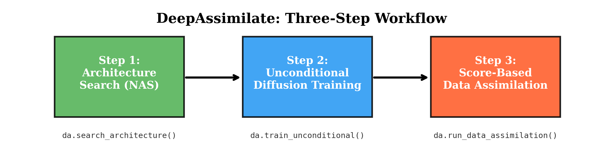
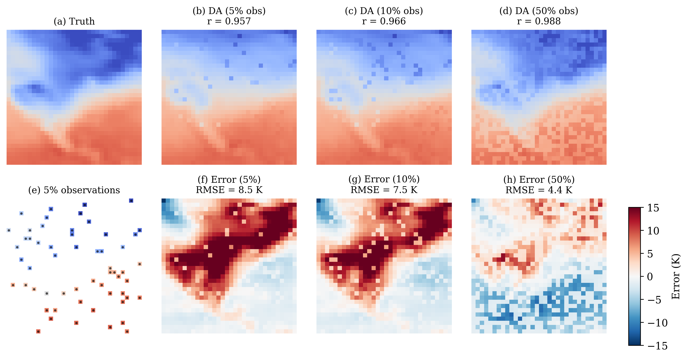
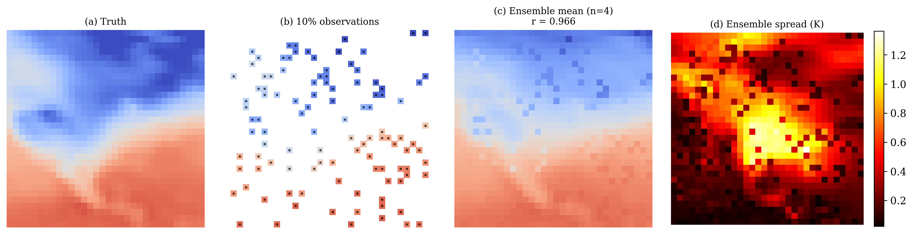

# DeepAssimilate

[](https://joss.theoj.org/papers/)
[](LICENSE)
[](https://www.python.org/downloads/)

**DeepAssimilate** is a Python library for diffusion-based generative data assimilation, targeting the climate and weather science community. Built on PyTorch and Hugging Face Diffusers, it provides a complete three-step workflow:

1. **Architecture Search** — Find the best diffusion model architecture via autoresearch-style NAS
2. **Unconditional Training** — Train the selected model on gridded climate/weather data
3. **Score-Based Data Assimilation** — Assimilate sparse observations into the trained prior

Each step is a **one-liner function call**, making diffusion-based DA accessible to domain scientists without deep ML expertise.

Based on [Manshausen et al. (2024)](https://arxiv.org/abs/2406.16947) and NVIDIA PhysicsNeMo ReGen.

### Three-Step Workflow



### Data Assimilation Results

Score-based DA on NCEP 2m temperature with sparse observations (5%, 10%, 50% coverage):



### Ensemble Uncertainty Estimation

Multiple posterior samples provide calibrated uncertainty estimates:



## Quick Start

```python
import deepassimilate as da

# Step 1: Find the best architecture
nas_result = da.search_architecture(
    train_dataset=train_ds, val_dataset=val_ds,
    cfg=da.NASConfig(time_budget_seconds=300, max_experiments=10)
)

# Step 2: Train the diffusion model
model, scheduler, _ = da.train_unconditional(
    dataset=train_ds,
    cfg=da.UncondTrainConfig(architecture="edm_unet_2d", num_epochs=100)
)

# Step 3: Assimilate sparse observations (one-liner!)
analysis = da.run_data_assimilation(
    model=model, scheduler=scheduler,
    observations=obs_with_nans,  # NaN = unobserved
    obs_noise_std=0.5, gamma=1e-3,
)
```

## Installation

```bash
pip install git+https://github.com/manmeet3591/DeepAssimilate.git
```

Or for development:

```bash
git clone git@github.com:manmeet3591/DeepAssimilate.git
cd DeepAssimilate
pip install -e .
```

### Requirements

- Python 3.9+
- PyTorch
- Hugging Face Diffusers
- xarray, netCDF4 (for weather data)
- matplotlib, numpy, tqdm

## How It Works

At each denoising step *t*, the unconditional sample is corrected using the observation likelihood gradient:

$$x_t \leftarrow x_t + \sigma(t) \cdot \nabla_{x_t} \log p(y \mid x_t)$$

where the likelihood variance combines observation noise with time-dependent regularization:

$$\text{var} = \sigma_{\text{obs}}^2 + \gamma \cdot (\sigma(t) / \mu(t))^2$$

This enables **zero-shot** posterior sampling — no retraining needed when observations change.

## Example Notebooks

| Notebook | Description |
|----------|-------------|
| [`00_quickstart_3step.ipynb`](examples/00_quickstart_3step.ipynb) | Full 3-step workflow on synthetic data |
| [`01_training_diffusion_priors_weather.ipynb`](examples/01_training_diffusion_priors_weather.ipynb) | NAS + training on NCEP reanalysis temperature |
| [`02_diffusion_da.ipynb`](examples/02_diffusion_da.ipynb) | Score-based DA with sparse observations |

## Key Features

- **All Diffusers models & schedulers** — UNet2D, attention variants, EDM/DDPM/DDIM/Euler/DPM-Solver
- **Autoresearch-style NAS** — Fixed time budget per candidate, results logged to TSV
- **Flexible observation operators** — Random masks, station locations, custom forward models
- **Ensemble DA** — Generate multiple posterior samples for uncertainty estimation
- **Auto-detection** — EDM vs DDPM scheduler type detected automatically

## Architecture

```
deepassimilate/
  nas/search.py            # Step 1: Neural Architecture Search
  training/uncond_trainer.py  # Step 2: Unconditional diffusion training
  assimilation/
    score.py               # Step 3: Score-based DA core
    pipeline.py            # Step 3: One-liner API (run_data_assimilation)
    observation_ops.py     # Observation operators and masks
  models/factory.py        # Model presets and factory
  schedulers/factory.py    # Scheduler factory (all diffusers schedulers)
  datasets.py              # WeatherDataset, GriddedDataset
```

## Tests

```bash
python -m pytest tests/test_core.py -v
```

## Citation

If you use DeepAssimilate in your research, please cite:

```bibtex
@article{deepassimilate2026,
  title={DeepAssimilate: A Python Framework for Diffusion-Based Generative Data Assimilation},
  author={Singh, Manmeet and Matakos, Alexandros and Sudharsan, Naveen and Renaldo, Nico and Santala, Jaakko and Kaisti, Kim},
  journal={Journal of Open Source Software},
  year={2026}
}
```

## License

GNU General Public License — see [LICENSE](LICENSE) for details.
